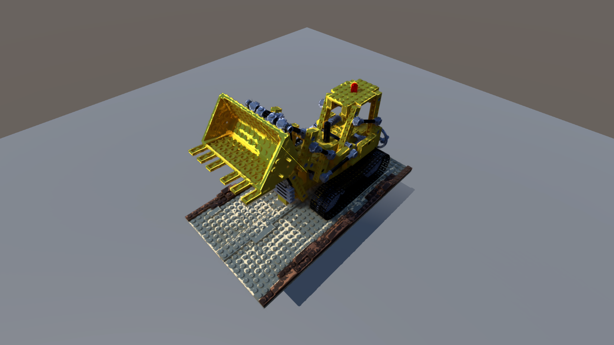
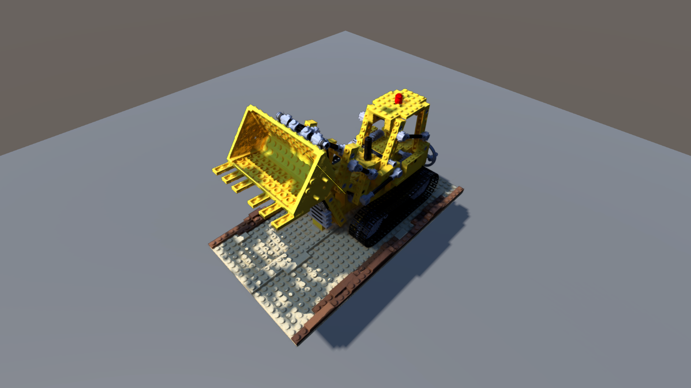
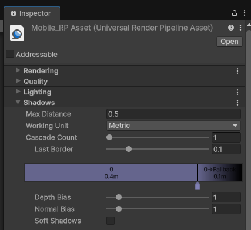
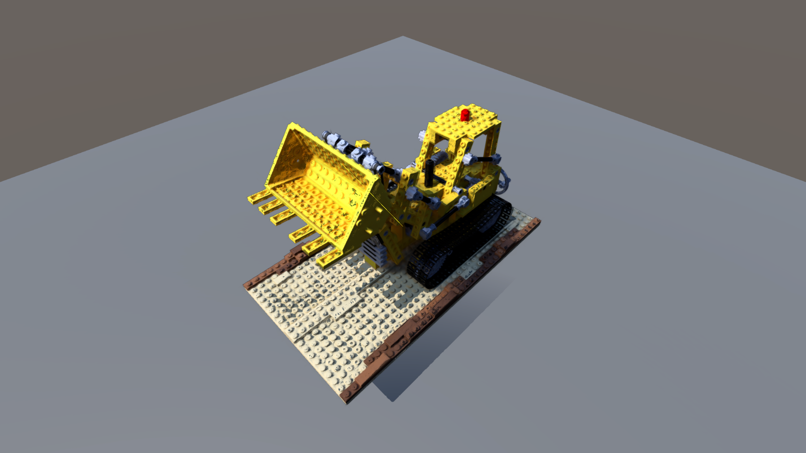
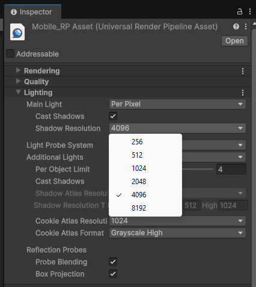
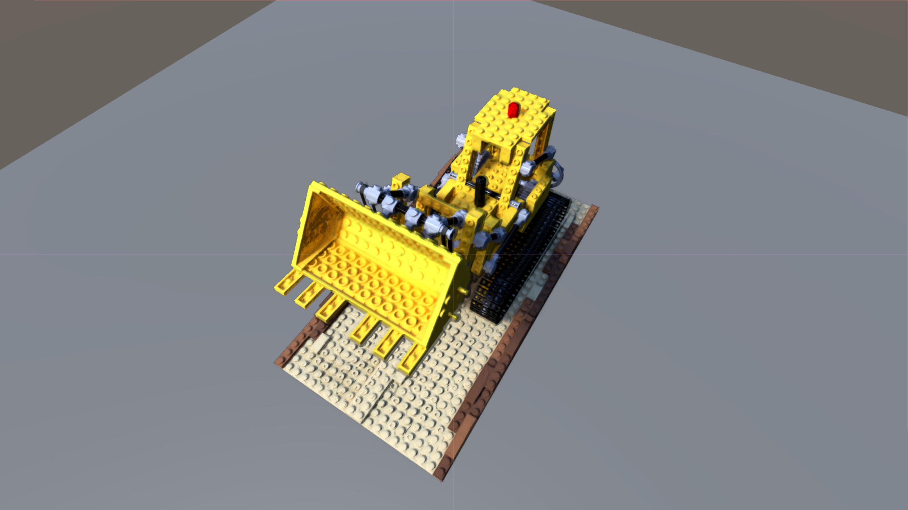

# Troubleshooting

3DGS 씬의 퀄리티에 따라 관련 광원 효과가 부자연스럽게 적용될 때가 있습니다.  
shadow bias를 자신의 3DGS 씬에 맞게 조절해가며 사용하기를 권장합니다.

또한 구현이 shadow map에 매우 의존합니다. 그림자가 충부한 해상도로 렌더링되지 않은 경우에도 부자연스러운 광원 효과를 볼 수 있습니다.

아래의 경우는 알려진 문제점과 해결방법입니다.

## 빛을 받는 표면임에도 어둡게 그림자가 생기는 경우

    

3DGS Scene에 Shadow Casting시 self-occlusion이 생기는 상황입니다. [Shadow acne](https://docs.unity3d.com/Manual/ShadowPerformance.html)와 비슷한 원리에 기반한 문제입니다. shadow bias를 조절하여 올바르게 그림지가 지도록 해야합니다.

## 3DGS 씬의 어두운 부분에 많은 구멍이 생김

    

Shadow casting을 위한 shadow map의 해상도가 충분하지 않은 경우 발생합니다. 두 가지 해상도를 올리는 전략이 있습니다.

### Shadows Max Distance 감소

    

URP Asset - Shadows - Max Distance 값을 충분히 낮춥니다.

> [!NOTE]
> Max Distance가 작을수록 그림자가 렌더링되는 범위가 좁아집니다.
> 

### Shadow Resolution 증가

    

URP Asset - Lighting - Shadow Resolution 값을 높입니다.

> [!NOTE]
> 해당 방법은 퍼포먼스 하락이 크지만, 극적인 shadow map의 해상도를 높이지 못합니다. 첫번째 방법으로 적당한 distance를 설정 한 후 추가적인 퀄리티를 위해 이 방법을 사용하세요

## 물체의 경계에서 굴절효과 비슷한 현상

    

경계에서 가우시안의 뎁스를 올바르게 추정하지 못해서 생기는 현상입니다. 수정중에 있습니다.
