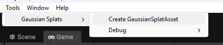
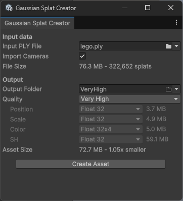
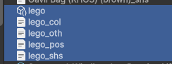
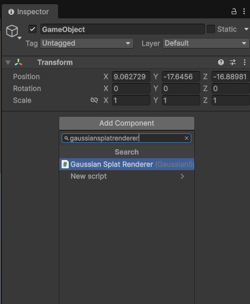
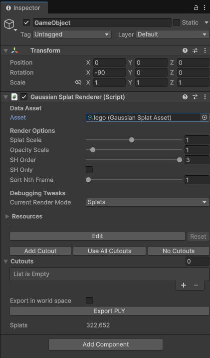

# Usage

[aras-p/UnityGaussianSplatting](https://github.com/aras-p/UnityGaussianSplatting) 플러그인의 Runtime Renderer가 아닌 GaussianRenderer에 의해 보이는 씬에만 적용됩니다.

해당 플러그인의 접근법은 매우 실험적이고 강건하지 않은 방법을 사용합니다. 3DGS 에셋의 종류와 특성에 따라 조명 효과가 차이날 수 있습니다. 잘 알려진 문제에 대한 내용은 [Troubleshooting](troubleshooting.md)을 참고하세요.

## Create 3DGS Asset

상단의 Tools - Gaussian Splats 메뉴에서 Create GaussianSplatAsset를 선택합니다.

    

유니티 에셋으로 변환할 ply파일을 선택하고 Create Asset 버튼을 눌러 생성합니다.

    

다음과 같은 에셋이 생성됩니다.

    

## Render 3DGS Asset

Unity Scene에 GameObject를 추가하고 GaussianRenderer를 추가합니다.

    

추가된 GaussianRenderer에 렌더링할 3DGS Asset을 설정합니다.

    

## Adjust Parameters

GaussianURPFeature에 있는 설정을 조절하여 적당한 결과가 나오도록 설정합니다.

<!-- TODO: URP Asset에 bias를 추가하고 이에 대한 설명 추가-->
